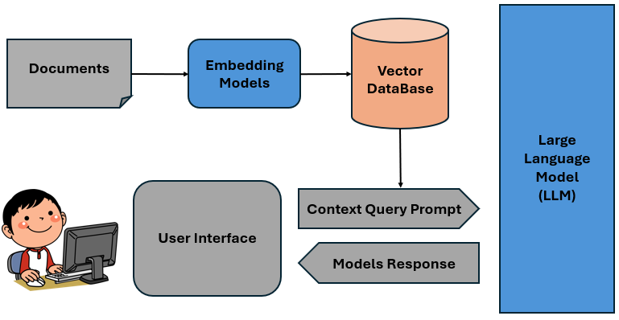

# LLM-Usecase
Deploy a Large-Language-Model (LLM) by using ollama, anythingllm and milvus as a Vector Database on Red Hat OpenShift. 



# Project Components

- **Milvus**: Is an open-source, high-performance vector database designed for managing and searching large-scale vector data. It is particularly useful in AI applications such as similarity search, recommendation systems, and retrieval-augmented generation (RAG) for text and images. 
- **Ollama**: Is a lightweight, extensible framework designed for building and running large language models on local machines. It provides a simple API for creating, running, and managing models, and includes a library of pre-built models that can be easily integrated into various applications. 
- **Anythingllm**: Is an all-in-one AI application designed to run large language models (LLMs) locally on your desktop. It allows you to chat with documents, use AI agents, and leverage various AI tools without needing complex setups or cloud resources. 
- **Minio**: Is an open-source, high-performance object storage system. It is capable of working with unstructured data such as photos, videos, log files, backups, and container images with the maximum supported object size being 50TB. 

# Prerequisites
- A Kubernetes cluster, something like OpenShift, Minikube, or any other managed Kubernetes services
- *kubectl* or *oc* CLI tools installed and configured

# Manual 

## Deploy Milvus, the Vector Database, in OpenShift

Deploy Milvus as a Standalone Database. 
Original Repository: [Milvus Repository](https://github.com/rh-aiservices-bu/llm-on-openshift/tree/main/vector-databases/milvus)

1. Create a new namespace/ project in OpenShift
2. Deploy Milvus by using the yaml-manifest file *milvus_manifest*
3. Additionally you can deploy a User Interface for the Milvus vector database byusing the *attu_manifest.yaml* file

> All resources should be created succesfully and al pods should run without any errors

## Deploy Minio Instance

1. Create a new namespace/ project in Openshift for the Minio instance
2. create Deployment from the manifests file *minio_manifest.yaml*

## Deploy Ollama Instance

1. Create a new namespace/ project in Openshift for the Ollama instance
2. Create the Pod in the namespace by using the container image from the following Repository. [RH Repository](quay.io/rh-aiservices-bu/ollama-ubi9) 
    - In Openshift: *+Add* by *Container Images* 
3. Go into the terminal of the ollama pod and use the *ollama* cli tool to check for the models inside the pod 
    - **Ollama Model Repository**: [Model Repo](https://ollama.com/search) 

> The size of the models is defined by the number of parameters of the model. *1b= 1 billion model parameters*. Thereby smaller models require less storage and computing power

```
## List all models:
ollama list

## pull a new model from the repo
ollama pull
```


